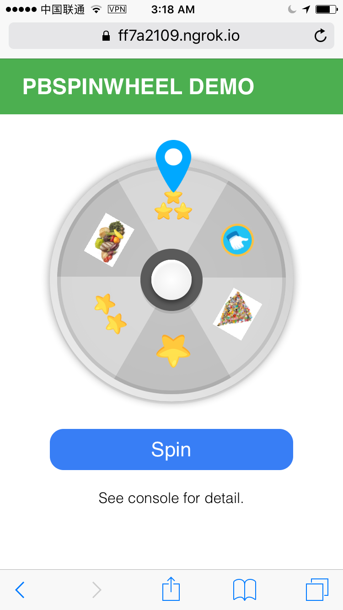

# pbSpinwheel 

It's based on [Polymer](https://www.polymer-project.org/1.0/).
Separate template and logic code into 2 files (.js, and .html).

The project utilize toolchain as provided from [basepolymerit](https://github.com/haxpor/basepolymerit).

# Intention

The aim of this project is to use only what's needed, and stay close to native platform or say pure javascript as much as possible.  
It doesn't depend on big library that would change the way (or get in the way, or require much higher knowledge) to work on with this project.

Whenever need to integrate to any project that already depended to specific library such as React, Angular 2, etc, it can still do so with slightly less effort.

# Why Chose to Do It This Way?

It's bacause developing from bottom to upper is much better in sense of web development. If this component depends one big dependency, then when it needs to support other users that use different library, it will find a very hard time to do that. We might have to migrate code for multiple times, or every time a new popular library pops up.

Thus this project stays low closely to native platform as much as possible, and depends on dependencies that are only necessary.

# How to

The startup project is generated via [basepolymerit-cli](https://github.com/haxpor/basepolymerit-cli).  
Commands to manage project and development are centralized into NPM's run scripts as follows, see [basepolymerit](https://github.com/haxpor/basepolymerit) for available commands such as `npm start`, `npm test`, `npm run server`, and couple more.

## Integration

We have demo of spinwheel working with pure Javascript + HTML, Angular 2, and React.  
For detail of integration for Angular 2, and React, please see them [here](https://github.com/playbasis/spinwheel-demo).

For Javascript + HTML project, follows the following steps.
> As spinwheel component is still in private, only given permission for client can use it. Thus it's not available on public registry such as bower, or NPM just yet. But we will improve the convenience on how to deliver the package to client in near future which might incorporate managing those package by ourselves and notify client to pull in those package from us.

* Create a new directory namely `playbasis` at the same level of your `index.html` file in your project.
* Put `pb-spinwheel` files which are `pb-spinwheel-component.v.html` and `pb-spinwheel-component.v.js` into `playbasis` directory.
* Copy `assets` directory and also put it at the same level of your `index.html` file.
* Execute `npm install --save-dev playbasis.js` to install our [JS SDK](https://github.com/playbasis/native-sdk-js)
* Execute `bower install --save-dev polymer` to install Polymer. This package is required to be working with spinwheel component.
* Modify your `index.html` to have the following code inside `<head></head>` at the top of your code.

```javascript
<!-- Import playbasis.js -->
<script src="node_modules/playbasis.js/dist/Playbasis.min.js"></script>
<!-- Import webcomponent and our polymer component -->
<script src="bower_components/webcomponentsjs/webcomponents-lite.min.js"></script>
<link rel="import" href="playbasis/pb-spinwheel-component.v.html">
```
* Add the following HTML code inside `<body></body>` to render spinwheel component (see *Spinwheel's Settings* section for its settings)

```html
<pb-spinwheel 
      env-point-reward-levels='{ "level2": 10, "level3": 30, "level4": 60 }'
      env-target-action="click"
      env-target-tag="spin-wheel"
      env-custom-param-url-values='["spin-wheel1", "spin-wheel2", "spin-wheel3"]'
      player-id="jontestuser"
      show-debug-log
    >Loading...</pb-spinwheel>
```
* You need to prepare `playbasis.js` first in Javascript code by adding the following code
   > API key and API secret are our testing application on Playbasis platform. You should be creating a new application ID via [https://pbapp.net/login](https://pbapp.net/login) whenever you're ready to develop your own application.

```javascript
	<script>
	...

	// 1.) Build Playbasis environment first
  Playbasis.builder
    .setApiKey("2043203153")
    .setApiSecret("144da4c8df85b94dcdf1f228ced27a32")
    .build();
  ...
  </script>
```
* Sucess and error as result from loading and spinning the wheel will be notified via event-based. You should listen to those event as follows

```javascript
	...
  // 2.) Listen to success & error events
  // listen to success event
  document.addEventListener("pb-spinwheel-success-event", function(e) {
    console.log("You got reward: ", e.detail);
    alert("You got reward!\nSee console for detail.");
  });

  // listen to any error event
  document.addEventListener("pb-spinwheel-error-event", function(e) {
    console.log("Error code " + e.detail.code + " with detail: '", e.detail, "'");
    alert("There's an error!\nSee console for detail.");
  });
  ...
```
* If you need to call member functions of spinwheel element as you already added it into DOM. You have to wait until `WebComponentsReady` is fired first, then you can further continue your usage. Use the following code

```javascript
	...
	// 3.) Do something after 'WebComponentsReady' is fired i.e. call component's member functions (if need)
  // when WebComponentsReady, then we can call members function of element class (if need)
  window.addEventListener('WebComponentsReady', function(e) {
  	console.log("WebComponents is ready");

    // get html element to access its property
    var elem = document.querySelector("pb-spinwheel");

    // do something here ...
    // such as calling its member functions
  });
  ...
```
* Done.  
   When look at browser, you should see something like this.  
   

## Spinwheel's Settings

There are several settings that can be configured to working with spinwheel component and your setup on your own rule on Playbasis dashboard too.

With bare-minimum, if you just use the following code

```html
<pb-spinwheel player-id="jontestuser">Loading...</pb-spinwheel>
```

it works too! But it will use default value of all setting that might not be the same as you set up on dashboard, then it will return error during the time you spin the wheel. Thus this section will help clarify all available settings.

**Attention**: You still need to set up your dashboard to make it works, not just configure settings as seen in this section. See section *Dashboard Setup* for more information.

The available settings are as follow

* **`env-point-reward-levels` - `Object Literal`<sub>Type</sub>** - *Optional*  
   Amount of point reward for each level that defines which point reward image the component will use when renders it. For example, if you set the rule on dashboard to have 4 different amount of point reward says 5, 10, 15, and 40. You can configure to let spinwheel component knows how it should display a proper image to match its amount for each case. Thus in result, it's better for visual.

   Currently it support 4 levels. If set it like `"level3": 30`, it means component will show level3 version of point reward image if such point reward is at least 30 or above. The component will make sure to show the image properly when you specified amount for all levels. Thus for `"level2": 10`, the component will show level2 version of point reward image if such point reward is at least 10 or above, but less than 30 (as it' set in case of `"level3"`).

   **Default values**  
   ```javascript
   env-point-reward-levels='{ "level2": 10, "level3": 30, "level4": 60 }'
   ```

* **`env-target-action` - `String`<sub>String</sub>** - *Optional*  
   Target action string to be checked when component is trying to fetch appropriated rules that can be used for spinning the wheel and give back reward from Playbasis platform. If action string is not matched, then the component won't include that rule in consideration.

   **Default values**  
   ```javascript
   env-target-action="click"
   ```

* **`env-target-tag` - `String`<sub>Type</sub>** - *Optional*  
   Target tag string to be checked when component is trying to fetch appropriated rules that can be used for spinning the wheel and give back reward from Playbasis platform. It tag string is not matched, then the component won't include that rule in consideration.

   **Default values**  
   ```javascript
   env-target-tag="spin-wheel"
   ```

* **`env-custom-param-url-values` - `Array Literal`<sub>Type</sub>** - *Optional*  
   Custom parameter value of key `url` (fixed and required) that will be used in checking for finding appropriated rules when the component is fetching the rules. It is array of possible string values.

   **Default values**  
   ```javascript
   env-custom-param-url-values='["spin-wheel1", "spin-wheel2", "spin-wheel3"]'
   ```

* **`player-id` - `String`<sub>Type</sub>  - Required**  
   Player id to be used on behalf of the API calls that the component will be calling.

   **Example usage**  
   ```html
   <pb-spinwheel player-id="jontestuser"></pb-spinwheel>
   ```

* **`show-debug-log`** - *Optional*  
   Include it to set the component to show debugging log during its operation too.  
   Please **do not** include this in production.

   **Example usage**  
   ```html
   <pb-spinwheel show-debug-log></pb-spinwheel>
   ```

## Dashboard Setup

To be added...

# Misc
This project is based on [https://github.com/haxpor/basepolymerit](https://github.com/haxpor/basepolymerit)

# License

This project is licensed under copyrights. You can see the license [here](https://github.com/playbasis/spinwheel-js/blob/master/README.md).

# Contact

Contact [devteam@playbasis.com](mailto:devteam@playbasis.com) if you have any question, or stuck in integration to your project.
